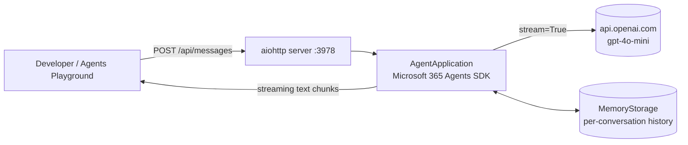
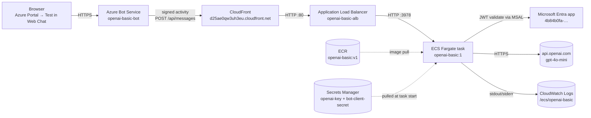

# OpenAI Basic Agent — Build & Deployment Guide

End-to-end documentation of the **OpenAI Basic Agent**: a Microsoft 365
Agents SDK chatbot that streams replies directly from the OpenAI Chat
Completions API (`gpt-4o-mini`). No Semantic Kernel, no plugins — just
chat with persisted multi-turn history. Two deployment targets are
covered:

1. **Local development** — anonymous mode, no cloud required.
2. **AWS ECS Fargate + CloudFront + Azure Bot Service** — full cloud
   hosting with a public Web Chat test page. AWS hosts the workload,
   Azure provides the channel/identity layer.

---

## Table of contents

- [Repository layout](#repository-layout)
- [Part 1 — Local app](#part-1--local-app)
  - [1.1 Architecture](#11-architecture)
  - [1.2 Build & setup process](#12-build--setup-process)
  - [1.3 Annotated code walkthrough](#13-annotated-code-walkthrough)
  - [1.4 What runs locally](#14-what-runs-locally)
  - [1.5 Testing the local app](#15-testing-the-local-app)
- [Part 2 — AWS ECS Fargate + CloudFront + Azure Bot](#part-2--aws-ecs-fargate--cloudfront--azure-bot)
  - [2.1 Architecture](#21-architecture)
  - [2.2 Why this shape](#22-why-this-shape)
  - [2.3 Deployment process (what was run)](#23-deployment-process-what-was-run)
  - [2.4 Annotated config of the cloud-mode code path](#24-annotated-config-of-the-cloud-mode-code-path)
  - [2.5 What was deployed](#25-what-was-deployed)
  - [2.6 Testing the cloud app](#26-testing-the-cloud-app)
  - [2.7 Logging & observability](#27-logging--observability)
  - [2.8 Cost & day-2 operations](#28-cost--day-2-operations)
  - [2.9 Tear everything down](#29-tear-everything-down)

---

## Repository layout

```
OpenAI-basic/
├── src/
│   ├── __init__.py
│   ├── main.py                 # process entry: `python -m src.main`
│   ├── app.py                  # AgentApplication + OpenAI streaming handler
│   └── start_server.py         # aiohttp server wiring (POST/GET /api/messages)
├── awsfiles/                   # everything AWS-specific
│   ├── README.md               # architecture + resource summary
│   ├── trust-ecs-tasks.json    # IAM trust doc for ECS task roles
│   ├── task-def.template.json  # task definition with placeholders
│   ├── task-def.json           # rendered task def (registered as revision 1)
│   ├── cloudfront-config.json  # CF distribution payload
│   ├── aws-resources.json      # full inventory of created resources
│   ├── pause-aws.ps1           # scale ECS service to 0 (stop compute charges)
│   ├── resume-aws.ps1          # scale back up + wait healthy
│   ├── redeploy-aws.ps1        # rebuild image + roll ECS service after code changes
│   └── cleanup-aws.ps1         # interactive full teardown
├── Dockerfile                  # python:3.12-slim container image
├── requirements.txt
├── env.TEMPLATE                # copy → .env locally
├── .env                        # local secrets (git-ignored)
├── .gitignore
├── README.md                   # quick start
└── DEPLOYMENT.md               # this document
```

---

# Part 1 — Local app

## 1.1 Architecture

Single-process Python aiohttp server on `localhost:3978`. JWT validation
is disabled (anonymous mode), so any HTTP client speaking the Bot
Framework activity protocol can talk to it (Bot Framework Emulator,
Microsoft 365 Agents Playground, etc.). OpenAI is called over HTTPS with
`stream=True` and chunks are pushed back to the channel as they arrive.



Key behaviors:

- `ANONYMOUS_AUTH=true` short-circuits MSAL — no Entra app needed.
- Chat history persisted per-conversation in `MemoryStorage` →
  `ConversationState.chatHistory` (list of `{role, content}` dicts).
- Replies stream over the original HTTP connection via
  `context.streaming_response.queue_text_chunk(...)`.

## 1.2 Build & setup process

### Prerequisites
- **Python 3.12** (the SDK supports 3.10–3.12).
- An OpenAI API key (`OPENAI_API_KEY=sk-proj-...`).
- Optional: [Microsoft 365 Agents Playground CLI](https://www.npmjs.com/package/@microsoft/agents-playground-cli)
  (`npm i -g @microsoft/agents-playground-cli`).

### Steps performed

```powershell
cd C:\sourcecode\OpenAI-basic

# 1. Create virtual environment
py -3.12 -m venv .venv
.\.venv\Scripts\Activate.ps1

# 2. Install dependencies
pip install -r requirements.txt

# 3. Provide secrets
Copy-Item env.TEMPLATE .env
# then edit .env and paste OPENAI_API_KEY

# 4. Run
python -m src.main
# ======== Running on http://0.0.0.0:3978 ========
```

`requirements.txt`:

```
microsoft-agents-hosting-aiohttp>=0.9.0,<1.0.0
microsoft-agents-hosting-core>=0.9.0,<1.0.0
microsoft-agents-authentication-msal>=0.9.0,<1.0.0
microsoft-agents-activity>=0.9.0,<1.0.0
openai>=2.0.0,<3.0.0
aiohttp>=3.10
python-dotenv>=1.0.0
```

## 1.3 Annotated code walkthrough

### `src/main.py` — process entry

```python
"""Process entry point: `python -m src.main`."""
import logging
from .app import AGENT_APP, AUTH_CONFIGURATION
from .start_server import start_server

logging.basicConfig(level=logging.INFO)
logging.getLogger("microsoft_agents").setLevel(logging.INFO)

start_server(
    agent_application=AGENT_APP,
    auth_configuration=AUTH_CONFIGURATION,
)
```

### `src/app.py` — AgentApplication wiring (the brains)

The same file works locally **and** on AWS. It branches on the
`ANONYMOUS_AUTH` environment variable.

```python
# Read OpenAI provider config (NOT Azure OpenAI).
OPENAI_API_KEY = environ.get("OPENAI_API_KEY", "")
OPENAI_MODEL   = environ.get("OPENAI_MODEL", "gpt-4o-mini")
SYSTEM_PROMPT  = environ.get("SYSTEM_PROMPT", "You are a friendly, concise assistant.")
if not OPENAI_API_KEY:
    raise RuntimeError("OPENAI_API_KEY is not set...")

OPENAI_CLIENT = AsyncOpenAI(api_key=OPENAI_API_KEY)

# Toggle auth mode without touching code:
#   ANONYMOUS_AUTH=true   → no MSAL (LOCAL).
#   ANONYMOUS_AUTH=false  → JWT validated against an Entra app (CLOUD).
ANONYMOUS_AUTH = environ.get("ANONYMOUS_AUTH", "true").lower() == "true"
STORAGE = MemoryStorage()

if ANONYMOUS_AUTH:
    AGENT_APP = AgentApplication[TurnState](storage=STORAGE, adapter=CloudAdapter())
    AUTH_CONFIGURATION = AgentAuthConfiguration(anonymous_allowed=True)
else:
    from microsoft_agents.hosting.core import Authorization
    from microsoft_agents.authentication.msal import MsalConnectionManager
    from microsoft_agents.activity import load_configuration_from_env

    agents_sdk_config  = load_configuration_from_env(environ)
    CONNECTION_MANAGER = MsalConnectionManager(**agents_sdk_config)
    ADAPTER            = CloudAdapter(connection_manager=CONNECTION_MANAGER)
    AUTHORIZATION      = Authorization(STORAGE, CONNECTION_MANAGER, **agents_sdk_config)
    AGENT_APP = AgentApplication[TurnState](
        storage=STORAGE, adapter=ADAPTER,
        authorization=AUTHORIZATION, **agents_sdk_config,
    )
    AUTH_CONFIGURATION = CONNECTION_MANAGER.get_default_connection_configuration()

# Conversation history: simple list[{role,content}] persisted via SDK state.
class ChatHistoryStoreItem(StoreItem):
    def __init__(self, messages=None):
        self.messages = messages or []
    def store_item_to_json(self):
        return {"messages": self.messages}
    @staticmethod
    def from_json_to_store_item(j):
        return ChatHistoryStoreItem(messages=list(j.get("messages", [])))

@AGENT_APP.activity("message")
async def on_message(context, state):
    user_text = (context.activity.text or "").strip()
    if not user_text: return

    context.streaming_response.queue_informative_update("Thinking...")

    history = state.get_value(
        "ConversationState.chatHistory",
        lambda: ChatHistoryStoreItem(),
        target_cls=ChatHistoryStoreItem,
    )
    messages = [{"role": "system", "content": SYSTEM_PROMPT}]
    messages.extend(history.messages)
    messages.append({"role": "user", "content": user_text})

    # Stream OpenAI tokens straight to the channel.
    full_reply = []
    stream = await OPENAI_CLIENT.chat.completions.create(
        model=OPENAI_MODEL, messages=messages, stream=True,
    )
    async for chunk in stream:
        if not chunk.choices: continue
        piece = chunk.choices[0].delta.content
        if piece:
            full_reply.append(piece)
            context.streaming_response.queue_text_chunk(piece)
    await context.streaming_response.end_stream()

    # Persist this turn so future requests have context.
    history.messages.append({"role": "user", "content": user_text})
    history.messages.append({"role": "assistant", "content": "".join(full_reply).strip()})
    state.set_value("ConversationState.chatHistory", history)
```

### `src/start_server.py` — aiohttp wiring

```python
def start_server(agent_application, auth_configuration):
    async def entry_point(req):
        return await start_agent_process(
            req, req.app["agent_app"], req.app["adapter"]
        )

    app = Application(middlewares=[jwt_authorization_middleware])
    app.router.add_post("/api/messages", entry_point)
    # GET returns 200 — used as an ALB / Container Apps liveness probe.
    app.router.add_get ("/api/messages", lambda _: Response(status=200, text="OK"))
    app["agent_configuration"] = auth_configuration
    app["agent_app"]           = agent_application
    app["adapter"]             = agent_application.adapter

    run_app(app,
        host=environ.get("HOST", "0.0.0.0"),
        port=int(environ.get("PORT", "3978")))
```

## 1.4 What runs locally

| Component | Location |
|---|---|
| Python venv | `C:\sourcecode\OpenAI-basic\.venv` (Python 3.12) |
| HTTP server | aiohttp on `http://0.0.0.0:3978` |
| Conversation state | In-memory (`MemoryStorage`) |
| LLM | `https://api.openai.com/v1/chat/completions` (`gpt-4o-mini`) |
| Auth | None (`ANONYMOUS_AUTH=true`) |

## 1.5 Testing the local app

```powershell
# Terminal 1 — run the agent
.\.venv\Scripts\Activate.ps1
python -m src.main

# Terminal 2 — health check
(Invoke-WebRequest http://localhost:3978/api/messages).StatusCode    # → 200

# Terminal 2 — chat UI
agentsplayground -e "http://localhost:3978/api/messages" -c "emulator"
```

---

# Part 2 — AWS ECS Fargate + CloudFront + Azure Bot

## 2.1 Architecture



Inbound flow:

1. Browser hits Azure Bot's **Test in Web Chat** UI in the portal.
2. Bot Service signs each Activity with a token issued for the Entra app
   (`4b84b0fa-…`) and `POST`s it to the CloudFront URL.
3. CloudFront terminates HTTPS, forwards to the ALB over HTTP :80.
4. ALB forwards to the Fargate task on :3978.
5. The task validates the JWT via MSAL using
   `CONNECTIONS__SERVICE_CONNECTION__SETTINGS__*` env vars.
6. OpenAI is called with `stream=True`; chunks bubble back through ALB →
   CloudFront → Bot Service → browser.

## 2.2 Why this shape

- **ECS Fargate** instead of Lambda / App Runner: App Runner is being
  deprecated; Fargate gives long-lived containers (needed for streaming
  responses) without managing EC2 hosts.
- **ALB in front of ECS**: gives a stable DNS for the service so we can
  scale tasks without notifying anyone, and adds health-check based
  rolling updates.
- **CloudFront in front of ALB**: Azure Bot Service requires an **HTTPS**
  endpoint with a valid public certificate. CloudFront's
  `*.cloudfront.net` cert is free; provisioning ACM + Route53 just for
  the bot would add cost and a custom domain dependency.
- **Secrets Manager** for `OPENAI_API_KEY` and the Entra client secret —
  ECS injects them as env vars at task start.
- **Single Azure resource** (the bot registration) — keeps Azure cost at
  $0 (F0 SKU) while leveraging the channel ecosystem (Web Chat, Teams,
  Direct Line, Email…).

## 2.3 Deployment process (what was run)

All commands used AWS CLI v2 + Azure CLI in PowerShell. AWS account
**`903219762962`**, region **`us-east-2`** (default VPC `vpc-72aa7919`).
Azure subscription **`MultiCloudTeam`**
(`d18f2ff3-4ef1-4102-8c8f-3a344037aeed`), resource group `OpenAI_weather`.

> PowerShell quirk: AWS CLI's short flag `-o text` is parsed by PowerShell
> first → "Unknown options". **Always use `--output text`.**

### Step A — ECR repository + image build

```powershell
$REGION = 'us-east-2'
$ACCT   = '903219762962'

aws ecr create-repository --repository-name openai-basic --region $REGION

aws ecr get-login-password --region $REGION |
  docker login --username AWS --password-stdin "$ACCT.dkr.ecr.$REGION.amazonaws.com"

docker build -t "$ACCT.dkr.ecr.$REGION.amazonaws.com/openai-basic:v1" C:\sourcecode\OpenAI-basic
docker push "$ACCT.dkr.ecr.$REGION.amazonaws.com/openai-basic:v1"
```

`Dockerfile`:

```dockerfile
FROM python:3.12-slim
WORKDIR /app
COPY requirements.txt ./
RUN pip install --no-cache-dir -r requirements.txt
COPY src/ ./src/
ENV PYTHONUNBUFFERED=1
EXPOSE 3978
CMD ["python", "-m", "src.main"]
```

### Step B — Microsoft Entra app (for Bot Service)

```powershell
$TENANT = az account show --query tenantId -o tsv
$APP    = az ad app create --display-name openai-basic-bot `
                            --sign-in-audience AzureADMyOrg -o json | ConvertFrom-Json
$APP_ID = $APP.appId   # 4b84b0fa-23b8-4d99-92b2-80bf741e04b9
$SECRET = az ad app credential reset --id $APP_ID --display-name botsecret `
                                      --years 2 --query password -o tsv
az ad sp create --id $APP_ID
```

### Step C — Secrets Manager

```powershell
$OPENAI_KEY = (Get-Content .env | Select-String '^OPENAI_API_KEY=').ToString().Split('=',2)[1]

$OPENAI_SECRET_ARN = aws secretsmanager create-secret `
  --name openai-basic/openai-key --secret-string $OPENAI_KEY --region $REGION `
  --query ARN --output text

$BOT_SECRET_ARN = aws secretsmanager create-secret `
  --name openai-basic/bot-client-secret --secret-string $SECRET --region $REGION `
  --query ARN --output text
```

### Step D — IAM roles

[awsfiles/trust-ecs-tasks.json](awsfiles/trust-ecs-tasks.json) is the
assume-role doc for `ecs-tasks.amazonaws.com`.

```powershell
# Execution role (pulls image, fetches secrets, writes logs).
aws iam create-role --role-name openai-basic-exec-role `
  --assume-role-policy-document file://C:/sourcecode/OpenAI-basic/awsfiles/trust-ecs-tasks.json
aws iam attach-role-policy --role-name openai-basic-exec-role `
  --policy-arn arn:aws:iam::aws:policy/service-role/AmazonECSTaskExecutionRolePolicy

# Inline policy: allow reading our two secrets.
$READ_SECRETS = @"
{ "Version":"2012-10-17","Statement":[{
  "Effect":"Allow","Action":"secretsmanager:GetSecretValue",
  "Resource":["$OPENAI_SECRET_ARN","$BOT_SECRET_ARN"]}]}
"@
$READ_SECRETS | aws iam put-role-policy --role-name openai-basic-exec-role `
  --policy-name read-secrets --policy-document file:///dev/stdin

# Task role (for application code; empty for now — no AWS API calls).
aws iam create-role --role-name openai-basic-task-role `
  --assume-role-policy-document file://C:/sourcecode/OpenAI-basic/awsfiles/trust-ecs-tasks.json
```

### Step E — Networking (Security groups, ALB, target group, listener)

```powershell
$VPC = 'vpc-72aa7919'
$SUBNETS = @('subnet-6e019822','subnet-a4df24cf','subnet-b5f7c6cf')

# ALB SG: allow :80 from internet.
$ALB_SG = aws ec2 create-security-group --group-name openai-basic-alb-sg `
  --description "ALB SG" --vpc-id $VPC --query GroupId --output text
aws ec2 authorize-security-group-ingress --group-id $ALB_SG `
  --protocol tcp --port 80 --cidr 0.0.0.0/0

# Task SG: allow :3978 only from the ALB SG.
$TASK_SG = aws ec2 create-security-group --group-name openai-basic-task-sg `
  --description "Task SG" --vpc-id $VPC --query GroupId --output text
aws ec2 authorize-security-group-ingress --group-id $TASK_SG `
  --protocol tcp --port 3978 --source-group $ALB_SG

# ALB + target group + listener.
$ALB_ARN = aws elbv2 create-load-balancer --name openai-basic-alb `
  --subnets $SUBNETS --security-groups $ALB_SG --scheme internet-facing `
  --type application --query 'LoadBalancers[0].LoadBalancerArn' --output text

$TG_ARN = aws elbv2 create-target-group --name openai-basic-tg --protocol HTTP --port 3978 `
  --vpc-id $VPC --target-type ip --health-check-path /api/messages `
  --query 'TargetGroups[0].TargetGroupArn' --output text

aws elbv2 create-listener --load-balancer-arn $ALB_ARN `
  --protocol HTTP --port 80 `
  --default-actions Type=forward,TargetGroupArn=$TG_ARN
```

> **Health check matcher fix:** the bot returns **401** on unauthenticated
> GETs, which ALB defaults to "unhealthy". Widen the matcher:
> ```powershell
> $m='{"HttpCode":"200,401"}'
> aws elbv2 modify-target-group --target-group-arn $TG_ARN --matcher $m --region $REGION
> ```

### Step F — ECS cluster, task def, service

[awsfiles/task-def.template.json](awsfiles/task-def.template.json) is the
template; it's rendered to [awsfiles/task-def.json](awsfiles/task-def.json)
substituting the role ARNs, image URI, secret ARNs, and Entra IDs.

```powershell
aws logs create-log-group --log-group-name /ecs/openai-basic --region $REGION
aws ecs create-cluster --cluster-name openai-basic --region $REGION

aws ecs register-task-definition `
  --cli-input-json file://C:/sourcecode/OpenAI-basic/awsfiles/task-def.json `
  --region $REGION

# Note: `assignPublicIp=ENABLED` is required because the default VPC has
# only an Internet Gateway — there's no NAT gateway for outbound traffic.
$netCfg  = '{"awsvpcConfiguration":{"subnets":["subnet-6e019822","subnet-a4df24cf","subnet-b5f7c6cf"],"securityGroups":["' + $TASK_SG + '"],"assignPublicIp":"ENABLED"}}'
$loadBal = '[{"targetGroupArn":"' + $TG_ARN + '","containerName":"app","containerPort":3978}]'

aws ecs create-service --cluster openai-basic --service-name openai-basic-svc `
  --task-definition openai-basic --desired-count 1 --launch-type FARGATE `
  --platform-version LATEST `
  --network-configuration $netCfg --load-balancers $loadBal `
  --health-check-grace-period-seconds 60 `
  --deployment-configuration "minimumHealthyPercent=0,maximumPercent=200" `
  --region $REGION
```

### Step G — CloudFront distribution (for HTTPS)

[awsfiles/cloudfront-config.json](awsfiles/cloudfront-config.json) holds
the full distribution payload. Key settings:

- **Origin:** ALB DNS, `OriginProtocolPolicy=http-only`.
- **ViewerProtocolPolicy:** `redirect-to-https`.
- **Allowed methods:** `GET, HEAD, OPTIONS, PUT, POST, PATCH, DELETE`.
- **Cache policy:** `CachingDisabled` (`4135ea2d-…`).
- **Origin request policy:** `AllViewer` (`216adef6-…`) so the bot
  framework's `Authorization` header is forwarded.

```powershell
aws cloudfront create-distribution `
  --distribution-config file://C:/sourcecode/OpenAI-basic/awsfiles/cloudfront-config.json
# → Id: E32Y1ORPYFSR72  Domain: d25ae0qw3uh3eu.cloudfront.net
```

CloudFront takes 5–15 minutes to reach **Deployed**.

### Step H — Azure Bot resource

```powershell
az bot create -g OpenAI_weather -n openai-basic-bot `
  --app-type SingleTenant --appid $APP_ID --tenant-id $TENANT `
  --endpoint https://d25ae0qw3uh3eu.cloudfront.net/api/messages `
  --sku F0 -l global
```

The Web Chat channel is enabled by default.

## 2.4 Annotated config of the cloud-mode code path

When `ANONYMOUS_AUTH=false`, `app.py` calls
`load_configuration_from_env(environ)`, which converts double-underscore
env vars into a nested dict using this convention:

```
CONNECTIONS__SERVICE_CONNECTION__SETTINGS__AUTHTYPE      → ClientSecret
CONNECTIONS__SERVICE_CONNECTION__SETTINGS__CLIENTID      → 4b84b0fa-23b8-4d99-92b2-80bf741e04b9
CONNECTIONS__SERVICE_CONNECTION__SETTINGS__CLIENTSECRET  → (from Secrets Manager)
CONNECTIONS__SERVICE_CONNECTION__SETTINGS__TENANTID      → e0ca6a1b-554d-4f12-87c9-92ec42abb750
```

The result is fed into `MsalConnectionManager`, which:

1. Validates inbound JWTs from Bot Service (issuer
   `https://api.botframework.com` and the configured tenant).
2. Acquires outbound tokens to call back to Bot Service when needed.

`Authorization` glues the connection manager into `AgentApplication` so
turn-level handlers can request tokens for OAuth flows later.

## 2.5 What was deployed

### AWS (us-east-2)

| Resource | Identifier | Notes |
|---|---|---|
| ECR repo + image | `903219762962.dkr.ecr.us-east-2.amazonaws.com/openai-basic:v1` | |
| Secrets Manager | `openai-basic/openai-key`, `openai-basic/bot-client-secret` | |
| IAM exec role | `openai-basic-exec-role` | + `AmazonECSTaskExecutionRolePolicy` + inline `read-secrets` |
| IAM task role | `openai-basic-task-role` | empty (no AWS API calls) |
| Security group (ALB) | `sg-0f0cdfcfb9b20a2c7` | :80 from `0.0.0.0/0` |
| Security group (task) | `sg-069e6613f11684037` | :3978 from ALB SG |
| ALB | `openai-basic-alb-914967461.us-east-2.elb.amazonaws.com` | internet-facing, HTTP :80 |
| Target group | `openai-basic-tg` | HTTP :3978, ip targets, matcher `200,401` |
| ECS cluster | `openai-basic` | |
| ECS service | `openai-basic-svc` | Fargate, 1 task, public IP enabled |
| Task definition | `openai-basic:1` | 256 CPU / 512 MB |
| CloudWatch log group | `/ecs/openai-basic` | stream prefix `app` |
| CloudFront | `E32Y1ORPYFSR72` → `d25ae0qw3uh3eu.cloudfront.net` | redirect-to-https, AllViewer policy |

### Azure

| Resource | Identifier | Notes |
|---|---|---|
| Entra app | `openai-basic-bot` (`4b84b0fa-23b8-4d99-92b2-80bf741e04b9`) | SingleTenant, 2-year secret |
| Tenant | `e0ca6a1b-554d-4f12-87c9-92ec42abb750` | |
| Azure Bot | `openai-basic-bot` (RG `OpenAI_weather`, SKU F0) | endpoint = CloudFront URL |

Container env vars (from `task-def.json`):
```
OPENAI_MODEL=gpt-4o-mini
PORT=3978
ANONYMOUS_AUTH=false
PYTHONUNBUFFERED=1
SYSTEM_PROMPT=You are a friendly, concise assistant.
CONNECTIONS__SERVICE_CONNECTION__SETTINGS__AUTHTYPE=ClientSecret
CONNECTIONS__SERVICE_CONNECTION__SETTINGS__CLIENTID=4b84b0fa-23b8-4d99-92b2-80bf741e04b9
CONNECTIONS__SERVICE_CONNECTION__SETTINGS__TENANTID=e0ca6a1b-554d-4f12-87c9-92ec42abb750
# Secrets injected from Secrets Manager:
OPENAI_API_KEY                                          ← openai-basic/openai-key
CONNECTIONS__SERVICE_CONNECTION__SETTINGS__CLIENTSECRET ← openai-basic/bot-client-secret
```

Full inventory in [awsfiles/aws-resources.json](awsfiles/aws-resources.json).

## 2.6 Testing the cloud app

### Health checks
```powershell
# Direct ALB (HTTP). 401 = bot reachable & auth working.
(Invoke-WebRequest 'http://openai-basic-alb-914967461.us-east-2.elb.amazonaws.com/api/messages' `
  -UseBasicParsing).StatusCode    # → 401

# CloudFront (HTTPS). Same expected response.
(Invoke-WebRequest 'https://d25ae0qw3uh3eu.cloudfront.net/api/messages' `
  -UseBasicParsing).StatusCode    # → 401
```

### Test in Web Chat (browser)
Azure Portal → Resource group `OpenAI_weather` → Bot resource
**`openai-basic-bot`** → **Test in Web Chat**.

Direct link:
`https://portal.azure.com/#@<tenantId>/resource/subscriptions/<subId>/resourceGroups/OpenAI_weather/providers/Microsoft.BotService/botServices/openai-basic-bot/test`

Sample prompts:
- "Hi"
- "Explain Fargate vs Lambda in one sentence"
- "What did I just ask?" (verifies multi-turn history)

### Add more channels (no code change)
Bot resource → **Channels** → enable Microsoft Teams, Direct Line, Email,
Web Chat embed, etc. The Fargate task keeps serving the same endpoint.

## 2.7 Logging & observability

### Live tail (CLI)
```powershell
# Find the latest log stream.
$stream = aws logs describe-log-streams --log-group-name /ecs/openai-basic `
  --order-by LastEventTime --descending --max-items 1 --region us-east-2 `
  --query 'logStreams[0].logStreamName' --output text

aws logs tail /ecs/openai-basic --follow --region us-east-2
```

### Useful CloudWatch Logs Insights queries
```
fields @timestamp, @message
| filter @message like /POST \/api\/messages/
| sort @timestamp desc
| limit 50
```

### ECS service events (good for debugging unhealthy targets)
```powershell
aws ecs describe-services --cluster openai-basic --services openai-basic-svc `
  --region us-east-2 `
  --query 'services[0].{Running:runningCount,Pending:pendingCount,Events:events[0:5].message}'
```

## 2.8 Cost & day-2 operations

### Approximate monthly cost (idle)

| Resource | Idle cost |
|---|---|
| Fargate task (256 CPU / 512 MB, 24x7) | ~$9/mo |
| ALB (always-on) | ~$16/mo |
| CloudFront | ~$0 idle (per-request pricing) |
| Secrets Manager (2 secrets) | ~$0.80/mo |
| ECR storage | pennies |
| CloudWatch Logs | pennies |
| Azure Bot F0 | $0 |

### Helper scripts (`awsfiles/`)

Four PowerShell scripts cover the common day-2 actions. They share the
same defaults (region `us-east-2`, cluster `openai-basic`, service
`openai-basic-svc`, CloudFront `E32Y1ORPYFSR72`) and accept overrides
as parameters.

| Script | Purpose |
|---|---|
| `pause-aws.ps1`    | Scale the ECS service to 0 tasks (stops Fargate compute charges). Optional `-DisableCloudFront` also disables the distribution. ALB and other resources stay in place so the Azure Bot endpoint URL does not change. |
| `resume-aws.ps1`   | Scale the service back up (default 1 task), wait for healthy targets, optional `-EnableCloudFront` to re-enable the distribution. |
| `redeploy-aws.ps1` | Rebuild the container image, push to ECR, register a new task-definition revision, and roll the ECS service. Run this after editing `src/*.py`, `requirements.txt`, or `Dockerfile`. |
| `cleanup-aws.ps1`  | Interactive full teardown of every AWS resource (CloudFront, ECS, ALB, security groups, IAM roles, secrets, log group, ECR repo). Skips the Azure Bot and Entra app — it prints the commands to delete those manually. |

#### Pause (cost savings while idle)

```powershell
# Scale ECS service to 0. Saves ~$9/mo (Fargate task).
# ALB still costs ~$16/mo — for full $0 idle, run cleanup-aws.ps1 instead.
.\awsfiles\pause-aws.ps1
.\awsfiles\pause-aws.ps1 -DisableCloudFront    # also disable CF distribution
```

#### Resume

```powershell
.\awsfiles\resume-aws.ps1                       # back to 1 task
.\awsfiles\resume-aws.ps1 -DesiredCount 2       # scale to N tasks
.\awsfiles\resume-aws.ps1 -EnableCloudFront     # also re-enable CF
```

#### Redeploy after code changes

Any change to `src/*.py`, `requirements.txt`, or `Dockerfile` is baked
into the container image, so it must be rebuilt and rolled:

```powershell
# Auto-bump tag (looks at ECR for highest vN and uses vN+1).
.\awsfiles\redeploy-aws.ps1

# Use a specific tag.
.\awsfiles\redeploy-aws.ps1 -Tag v5

# Skip the build (e.g., you only edited env vars in task-def.json).
.\awsfiles\redeploy-aws.ps1 -SkipBuild

# Don't block waiting for services-stable (deploy continues in background).
.\awsfiles\redeploy-aws.ps1 -SkipWait
```

What the redeploy script does, step by step:

1. Picks the next image tag (e.g. `v1` → `v2`) by listing ECR tags.
2. `docker login` to ECR, `docker build` from the project root, `docker push`.
3. Patches `awsfiles/task-def.json` with the new image URI (in-place).
4. `aws ecs register-task-definition` → returns the new revision ARN.
5. `aws ecs update-service --task-definition <new-arn> --force-new-deployment`.
6. `aws ecs wait services-stable` (unless `-SkipWait`).
7. Smoke-tests the CloudFront URL (expects HTTP 401 — confirms auth is on).

> If the service was paused (`desired-count = 0`), `redeploy-aws.ps1`
> will register the new revision but the rollout won't start tasks. Run
> `resume-aws.ps1` first or after.

#### Things you do NOT need to redeploy for

- Adding a new bot channel (Teams, Direct Line, etc.) → Azure Portal only.
- Updating the bot endpoint URL → `az bot update` only.
- Updating env vars or secret values → edit `task-def.json` (or rotate the
  secret in Secrets Manager) then `redeploy-aws.ps1 -SkipBuild`.
- Microsoft 365 Agents (A365) **manifest** changes — only the manifest /
  Entra app exposure changes; the Python code is unchanged so no rebuild.
  If A365 onboarding requires editing `src/app.py` or `src/main.py`, then
  yes — run `redeploy-aws.ps1`.

### Rotate the bot client secret

```powershell
$NEW = az ad app credential reset --id 4b84b0fa-23b8-4d99-92b2-80bf741e04b9 `
        --display-name botsecret-v2 --years 2 --query password -o tsv
aws secretsmanager put-secret-value --region us-east-2 `
  --secret-id openai-basic/bot-client-secret --secret-string $NEW
aws ecs update-service --cluster openai-basic --service openai-basic-svc `
  --force-new-deployment --region us-east-2
```

## 2.9 Tear everything down

The interactive cleanup script handles ordering (CloudFront takes ~20 min
to disable + delete):

```powershell
.\awsfiles\cleanup-aws.ps1            # prompts before each step
.\awsfiles\cleanup-aws.ps1 -Force     # no prompts
.\awsfiles\cleanup-aws.ps1 -SkipCloudFront   # skip the slow CF step
```

It does **not** delete the Entra app or the Azure Bot. Remove those with:

```powershell
az bot delete -g OpenAI_weather -n openai-basic-bot --yes
az ad app delete --id 4b84b0fa-23b8-4d99-92b2-80bf741e04b9
```
